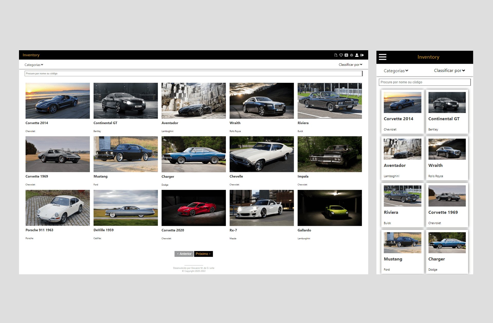

# Inventory Control (Front-end)

Back-end corresponding: https://github.com/GiovanniLeite/inventory-control-back-end

## 📋 Presentation

This web application serves as a comprehensive collection management system, covering a wide range of items including cars, games, and more. Powered by React on the frontend and backed by a RESTful API built with Node.js, it seamlessly connects to a MySQL database. The application boasts an array of features, offering user-friendly pages for Login, Registration, Home, Item management, Profile editing, Category management, Wishlist management, and more. Users can easily search, sort alphabetically, paginate through items, and generate various types of reports. The project was successfully completed in October 2021.

## 🛠️ Front-end built with
- JavaScript
- React.js
- Redux
- HTML5
- CSS3
- Styled-components
- ESLint
- Prettier

## 📫 Contact

